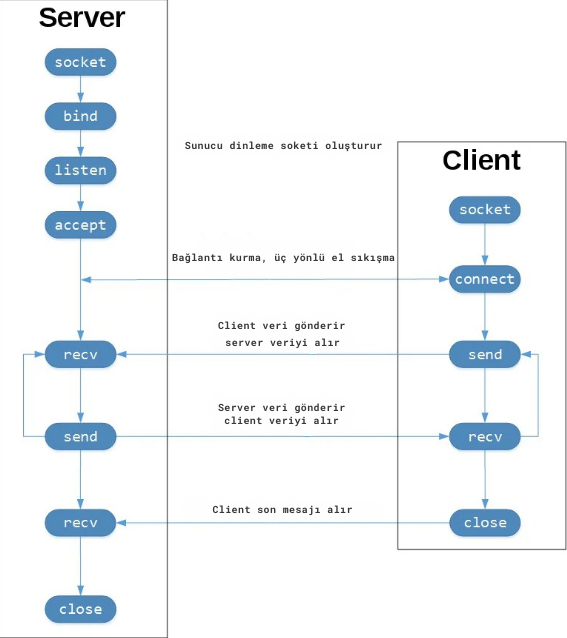

# Python TCP Anlık Mesajlaşma Uygulaması

Bu proje, Python ve TCP protokolü kullanılarak geliştirilmiş basit bir anlık mesajlaşma uygulamasıdır.

## Özellikler

- Kullanıcı bazında gelen mesajlar kaydedilir.
- Geçmiş mesaj bilgilerine erişilebilir.
- Kullanıcıların bağlantı listesi oluşturulur.
- Listede gruplandırma yapılabilir (arkadaşlarım, ailem, diğer, vb.).
- Geçmiş mesajlar anahtar kelimeye göre aranabilir.

## Başlarken

Bu projeyi yerel makinenizde çalıştırmak için aşağıdaki adımları takip edin.

### Gereksinimler

- Python 3.6 veya daha yüksek bir sürüm

### Kurulum

1. Bu depoyu klonlayın veya indirin.
2. Bağımlılıkları yükleyin:
3. Sunucuyu başlatın:
4. Yeni bir terminal penceresinde, istemciyi başlatın:

## Kullanım

Uygulama başlatıldığında, kullanıcı adınızı girerek sunucuya bağlanabilirsiniz. Daha sonra, diğer kullanıcılara mesaj gönderebilir ve onlardan mesaj alabilirsiniz.

## TCP Soketi

Aşağıdaki diyagram API çağrılarını ve TCP üzerindeki veri akışını göstermektedir.

## Katkıda Bulunma

Projeye katkıda bulunmak istiyorsanız, lütfen aşağıdaki adımları izleyin:

1. Projeyi 'fork'layın.
2. Özellik veya düzeltme için bir dal (branch) oluşturun (`git checkout -b feature/fooBar`).
3. Değişikliklerinizi yapın ve dalınıza 'commit'leyin (`git commit -am 'Add some fooBar'`).
4. Dalınızı 'push'layın (`git push origin feature/fooBar`).
5. Yeni bir 'pull request' oluşturun.